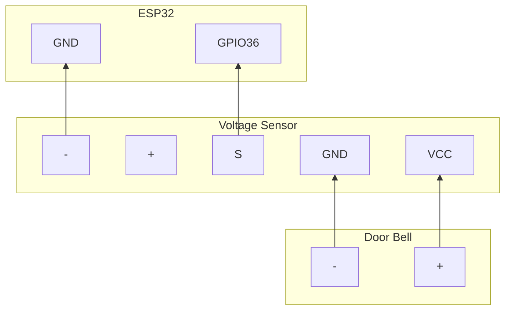

This is the config and board I use to detect the door bell buzzer "ringing" for my apartment using ESP32-WROOM-32 boards.


::callout{color="amber" icon="i-ph-warning"}
Before you do anything involving power, please make sure to use a Multimeter and/or contact an electrician before you hurt yourself.
::

## Components

- 1x ESP32-WROOM-32 (probably will work wither other ESP32 board as long as they have a ADC enabled pins)
- 1x 25V voltage tester/sensor (I have taken the photo from the Amazon listing, please don't sue me) - I bought them from [Amazon here](https://www.amazon.de/dp/B07G8WYHFJ).

## Pins



## ESPHome Config

```yaml
esphome:
  name: my-door-bell
  friendly_name: "My Door Bell"

esp32:
  board: esp32dev
  framework:
    type: arduino

# Enable logging
logger:
  level: WARN

# Enable Home Assistant API
api:
  encryption:
    key: "YOUR_HASSIO_API_ENCRYPTION_KEY"

ota:
  - platform: esphome
    password: "YOUR_OTA_PASSWORD"

wifi:
  ssid: !secret wifi_ssid
  password: !secret wifi_password
 
binary_sensor:
  - platform: template
    name: "My Door Bell"
    id: my_door_bell
    icon: "mdi:doorbell"
    # If you know a better device class for this use case, please let me know :-D
    device_class: power
    publish_initial_state: True

sensor:
  - platform: adc
    pin: GPIO36
    name: "My Door Bell"
    id: "my_door_bell_voltage"
    update_interval: 0.15s
    internal: true
    attenuation: 12db
    filters:
      - multiply: 3.3
    on_value_range:
      above: 4.18
      then:
        if:
          condition:
            binary_sensor.is_off: my_door_bell
          then:
            - binary_sensor.template.publish:
                id: my_door_bell
                state: on
            - delay: 6s
            - binary_sensor.template.publish:
                id: my_door_bell
                state: off
```
