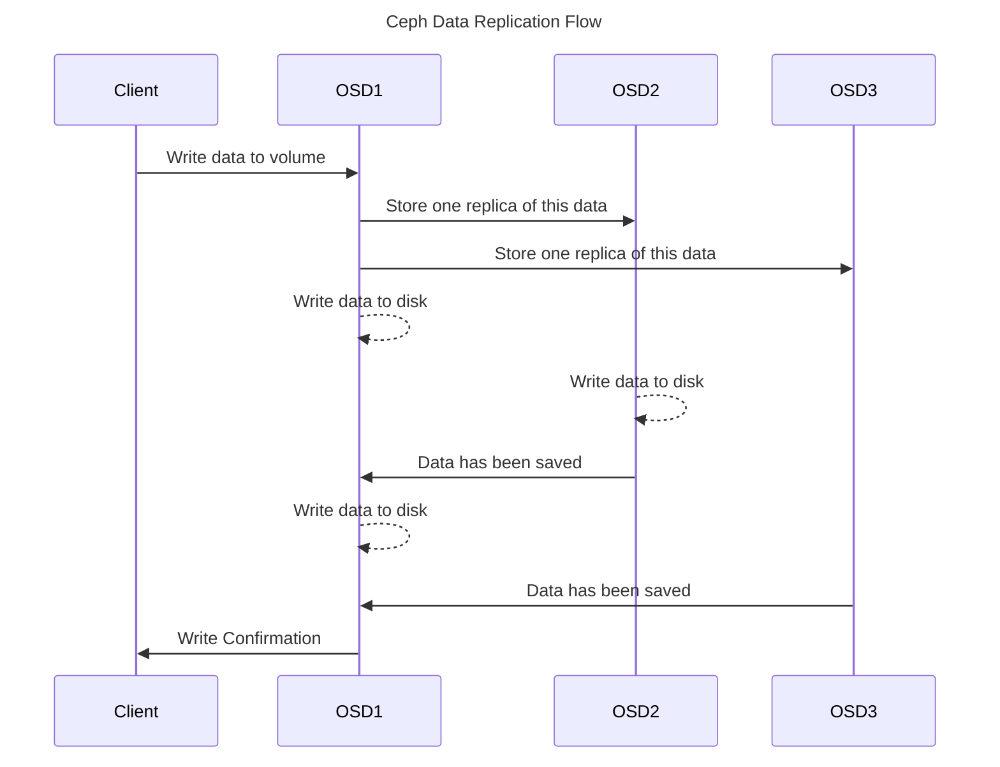

::callout{icon="i-ph-info" color="info"}
This blog post is originally from the Koor Technologies, Inc. website which due Koor Technologies, Inc. closure in early 2024 doesn't exist anymore.
::

Have you ever wanted to add more than one network interface to your Pods? Need a safer way to connect a _legacy_ application to multiple network VLANs in Kubernetes? Let's see how we can achieve this for a Rook Ceph cluster.

Normally in Kubernetes a Pod only has a single interface to communicate on the cluster network. This is and should be enough for most applications, but for production Rook Ceph deployments it isn't good enough.
From Ceph's recommendation, you should preferably use two different networks. A _public network_ on which clients can and will talk to all the Ceph cluster components and the second _cluster network_. The _cluster network_, as the name might imply is used for certain Ceph cluster traffic, to be exact the Ceph OSD data replication traffic.

A long time ago, [`kube-proxy`](https://kubernetes.io/docs/concepts/overview/components/#kube-proxy) was still using `iptables` (by default at the time) to _route_ traffic to service IPs, the `hostNetwork` option was a common way to increase network "throughput". `hostNetwork: true` does that by exposing the node's network stack to the Pod's containers. At first glance, this might sound great, but it comes with some drawbacks in the security department.
I can still remember jokingly running `shutdown` in a `hostNetwork` Pod and, let's just say I was thankfully able to somehow power on the server again through _good_ old remote management interface (IPMI). So take that `hostNetwork` mode, you can _weaken_ the isolation of containers by a lot.

You will end up with more traffic on the _cluster network_ than on the _public network_ for a simple reason, a client needs to "write" data once to an OSD, but the OSD needs to talk with an X amount of other OSDs to fulfill the replication requirement of the storage pool.

A simplified diagram of this flow of data from a client:

::mermaid

::

Sidenote: That's a reason why Ceph can appear slower in direct comparisons with other storage projects because an input/ "data write" operation is only confirmed after it has been fully replicated.

***

## So where does Multus come into play here?

Multus allows you to attach one or more (specific) network interfaces to your Pods. Making the whole ordeal of setting a Pod's network interfaces to a Pod streamlined.
There are still going to be some security implications when you, e.g., attach a node's network interface to a Pod, but at least it is made transparent through [Multus' `Custom Resource Definitions`](https://github.com/k8snetworkplumbingwg/multus-cni/blob/0c37bb043c704a730535a011a19c0bde36c1463b/docs/quickstart.md#storing-a-configuration-as-a-custom-resource).

A security team could simply restrict access to these "network definitions" using RBAC in Kubernetes. This in combination with a _policy agent_ (e.g., [Open Policy Agent (OPA)](https://www.openpolicyagent.org/)), can help enforce certain "network access policies".
For monitoring/ auditing as well, you can just keep an eye on which network definitions are used by which Pods.

Let's assume we have a Kubernetes node with two physically connected network interfaces. Let's stick to the "good old" interface naming schema to keep it simple: `eth0` and `eth1` interface. :winking_face:

`eth0` is used as the "default" interface of the node, we will be using `eth0` for the Ceph _public network_ (client traffic) and `eth1` for Ceph's OSD replication. For simplicity, we'll assume both networks have a [DHCP server](https://en.wikipedia.org/wiki/Dynamic_Host_Configuration_Protocol) running.

To get started, we need to [create two `NetworkAttachDefinitions`](https://github.com/k8snetworkplumbingwg/multus-cni/blob/master/docs/quickstart.md#storing-a-configuration-as-a-custom-resource):

```yaml
apiVersion: "k8s.cni.cncf.io/v1"
kind: NetworkAttachmentDefinition
metadata:
  name: ceph-public-net
spec:
  config: '{
      "cniVersion": "0.3.1",
      "type": "host-device",
      "device": "eth0",
      "ipam": {
        "type": "dhcp"
      }
    }'
---
apiVersion: "k8s.cni.cncf.io/v1"
kind: NetworkAttachmentDefinition
metadata:
  name: ceph-cluster-net
spec:
  config: '{
      "cniVersion": "0.3.1",
      "type": "host-device",
      "device": "eth1",
      "ipam": {
        "type": "dhcp"
      }
    }'
```

Short explanation on what the `.spec.config` here means:
* `"type": "host-device"` uses the [`host-device` CNI plugin](https://www.cni.dev/plugins/current/main/host-device/) to "Move an already-existing device into a container."
* `ipam` section, `"type": "dhcp"` [`dhcp` CNI plugin](https://www.cni.dev/plugins/current/ipam/dhcp/) tells the CNI to get an IP from a DHCP server.

You can run `kubectl get network-attachment-definitions` to confirm that both `NetworkAttachmentDefinitions` have been created.

**Warning**: For existing clusters, you currently can't easily switch from, e.g., "container network" to `hostNetwork` mode/ Multus.

```yaml
apiVersion: ceph.rook.io/v1
kind: CephCluster
metadata:
  name: rook-ceph
  namespace: rook-ceph
spec:
  [...]
  network:
    provider: multus
    selectors:
      public: ceph-public-net
      cluster: ceph-cluster-net
  [...]
```

(Documentation: [Ceph Cluster CRD - Multus Configuration - Rook Ceph v1.11](https://rook.io/docs/rook/v1.11/CRDs/Cluster/ceph-cluster-crd/#multus))

This will tell the Rook Ceph operator to "attach" the Multus network annotations to the Ceph components, no need to add anything else to the `CephCluster` object.

To summarize, we can use Multus to more specifically and easily have a Rook Ceph cluster use two different networks for [performance reasons](https://docs.ceph.com/en/quincy/rados/configuration/network-config-ref/).

***

Looking back at the [time I implemented](https://github.com/rook/rook/pull/975) `hostNetwork` mode in Rook, it is still the simplest way
to "skip the container network" to gain more performance (depending on the CNI encapsulation, etc., used by your Kubernetes cluster network) or expose a service to other clusters/ servers which "can't be just 'loadbalanced'/ proxied".

We are looking into improving the existing documentation and examples, to make it easier for people to use Multus, instead of `hostNetwork` mode, with their Rook Ceph clusters.

If you want to get a more in-depth look at what Multus can do, be sure to check out this great post by [devopstales](https://devopstales.github.io/) here: [Use Multus CNI in Kubernetes - devopstales](https://devopstales.github.io/kubernetes/multus/).
To look at what other plugins and config options the CNI project and plugins have, check out [CNI Documentation - Plugins Overview](https://www.cni.dev/plugins/current/).

Thanks for reading!
